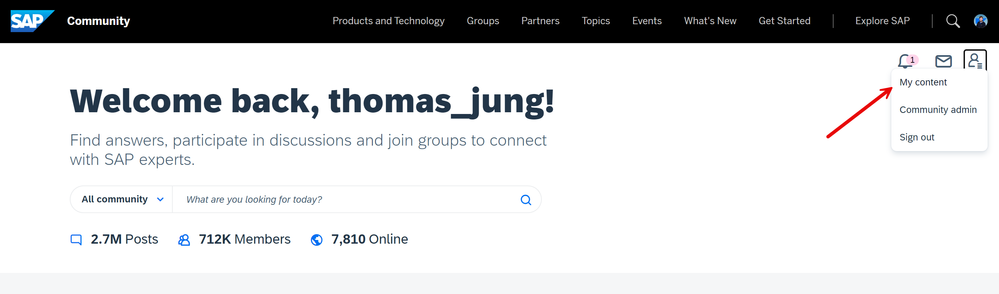
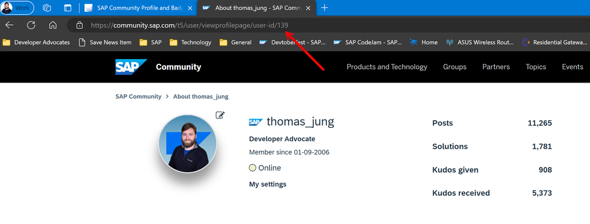
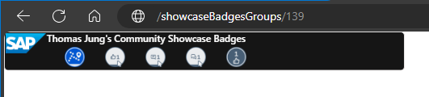
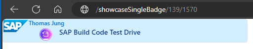
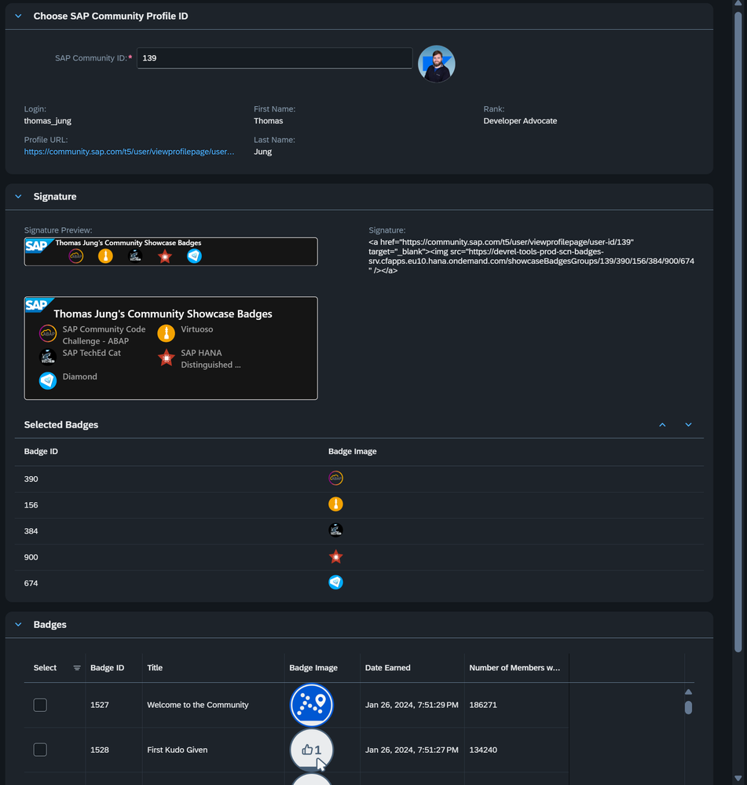

# SAP Community Cards

## Introduction

This service creates cards as images (svg or png) to display your SAP Community activity and achievements. Now you can share you SAP Community pride in other locations, such as you GitHub README or in your SAP Community signature.

For more details on your SAP Community Profile in general, we'd suggest you access this tutorial: [Tour the SAP Community 2024](https://developers.sap.com/mission.community-2024.html)

This service only works with data which you've chosen to expose from your public SAP Community Profile. Please refer to the [SAP Community Privacy statement](https://www.sap.com/about/legal/privacy.html) for more details.

For these services to work you will need to know your SAP Community ID. You will, of course, need to be signed into the Community.  If so, you can click on the person silhouette in the upper right corner and choose My content. This will navigate you to your profile overview as well as where you can configure settings within the SAP Community.

The SAP Community ID is an integer that you can find at the end of URL of your public profile page.

## Showcase Badges

Simply add you SAP Community ID to the end of the `/showcaseBadges` path and the 5 most recent badges you have have earned will appear in this card.

Example: [/showcaseBadges/your.SCN.ID](./showcaseBadges/your.SCN.ID)

You can also add the URL parameter `png=true` if you want to receive a png image file instead of the default svg

Example: [/showcaseBadges/your.SCN.ID?png=true](./showcaseBadges/your.SCN.ID?png=true)

There is also smaller version of the showcase badges designed to better fit into the SAP Community Signature. It can be accessed from `/showcaseBadgesGroups`

Example: [/showcaseBadgesGroups/your.SCN.ID](./showcaseBadgesGroups/your.SCN.ID)

And there is a variant that uses a light colored theme and only displays a single badge with details. It can be accessed from `/showcaseSingleBadge`

Example: [/showcaseSingleBadge/your.SCN.ID](./showcaseSingleBadge/your.SCN.ID/badge.ID)

All of the Showcase Badges also allow you to specify specific badges that you have earned instead of displaying only your most recently earned badges. We even have a tool that can help you select these badges and build the showcase URL. That tool can be accessed from `/flp/#profile-ui`.

Example: [/flp/#profile-ui](./flp/#profile-ui)

You can read more about how to use this tool here: [New SAP Community - Profile Signatures](https://community.sap.com/t5/what-s-new/new-sap-community-profile-signatures/ba-p/13598678)

## Activity Badges

Simply add you SCN ID to the end of the `/activity` path and the number of posts and rank will appear in this card.

Example: [/activity/your.SCN.ID](./activity/your.SCN.ID)

You can also add the URL parameter `png=true` if you want to receive a png image file instead of the default svg

Example: [/activity/your.SCN.ID?png=true](./activity/your.SCN.ID?png=true)

## Swagger UI

This service contains it's own tooling for testing the internal APIs. It can be accessed from `/docs/`.

Example: [/docs/](./docs/)

## Fiori Launchpad

Fiori Launchpad for SAPUI5 applications connected to this service `/flp`

Example: [/flp/](./flp/)

## Selfie with the Dev Advocates

Example: [/flp/#selfie-ui](./flp/#selfie-ui)

## Community Profile and Badge Signature Tool

Example: [/flp/#profile-ui](./flp/#profile-ui)

## Community Event Registration Admin Tool

Internal tool for event organizers to see the users registered for events to send reminder emails or download attendees in Excel format. Uses path `/khoros/eventRegs/eventBoardName`

Example: [/khoros/eventRegs/codejam-events](./khoros/eventRegs/codejam-events)

## Devtoberfest Contest Gameboard

Devtoberfest will be a points-based contest.  Points are awarded for things like attending one of the educational sessions, completing certain developer tutorials tied to the topic weeks, or other activities that contribute to the SAP Developer Community. Prizes are awarded based upon SAP Community badges which you earn and you must have a public Community profile to participate.

We brought back the animated Contest Gameboard to help you track your progress through the contest.  Just add your SAP Community ID  to the end of the following URL: [/devtoberfestContest/scnId.Here](./devtoberfestContest/scnId.Here)

The SAP Community ID is an integer that you can find at the end of URL of your public profile page.

There is also a profile check tool at: [/devtoberfest/profile/scnId.Here](./devtoberfest/profile/scnId.Here)
