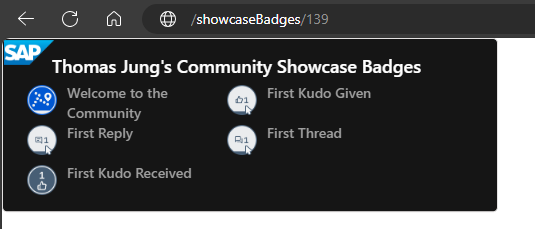
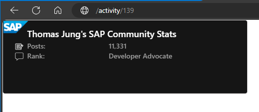

# SAP Community Cards

## Introduction

This service creates cards as images (svg or png) to display your SAP Community activity and achievements. Now you can share you SAP Community pride in other locations, such as you GitHub README.

For more details on your SAP Community Profile in general, we'd suggest you access this tutorial: [Update and Maintain Your SAP Profile at people.sap.com](https://developers.sap.com/tutorials/community-profile.html)

This service only works with data which you've chosen to expose from your public SAP Community Profile. Please refer to the [SAP Community Privacy statement](https://www.sap.com/about/legal/privacy.html) for more details

## Showcase Badges

Simply add you SCN Profile ID to the end of the `/showcaseBadges` path and the 5 top badges you have selected to be part of your public profile will appear in this card.

Example: [/showcaseBadges/your.SCN.ID](./showcaseBadges/your.SCN.ID)

You can also add the URL parameter `png=true` if you want to receive a png image file instead of the default svg

Example: [/showcaseBadges/your.SCN.ID?png=true](./showcaseBadges/your.SCN.ID?png=true)

## Activity Badges

Simply add you SCN Profile ID to the end of the `/activity` path and the number of blog posts, comments, answers, and questions will appear in this card.

Example: [/activity/your.SCN.ID](./activity/your.SCN.ID)

You can also add the URL parameter `png=true` if you want to receive a png image file instead of the default svg

Example: [/activity/your.SCN.ID?png=true](./activity/your.SCN.ID?png=true)